# 💳 IguaçuCard — Backend (Java Swing + Hibernate)

Backend do sistema de gestão de cartões sociais **IguaçuCard**, com interface administrativa em **Java Swing**, persistência via **Hibernate/JPA** e suporte a **MySQL** ou **H2** embarcado.

> Toda a lógica de negócio, autenticação, controle de sessão, emissão de cartões e transações — em uma aplicação desktop única.

---

## 🖼 Prévia (design atualizado)

| Tela | Preview |
|------|---------|
| **Login** | 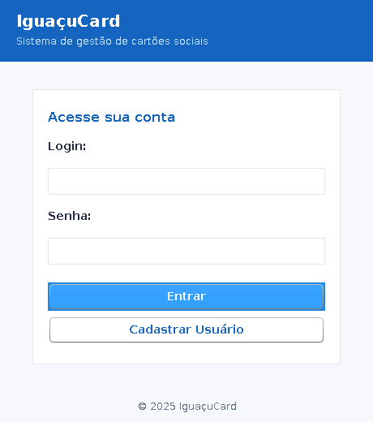 |
| **Cadastro de Usuário** | 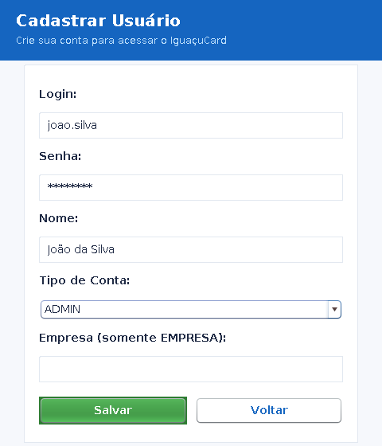 |
| **Painel Administrativo** | 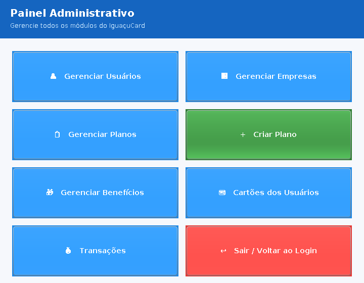 |
| **Painel do Usuário** | 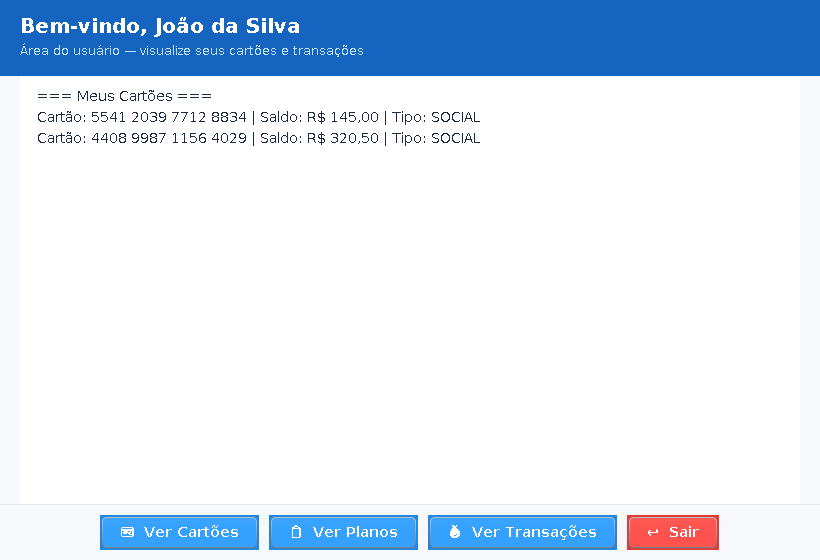 |
| **Painel da Empresa** | 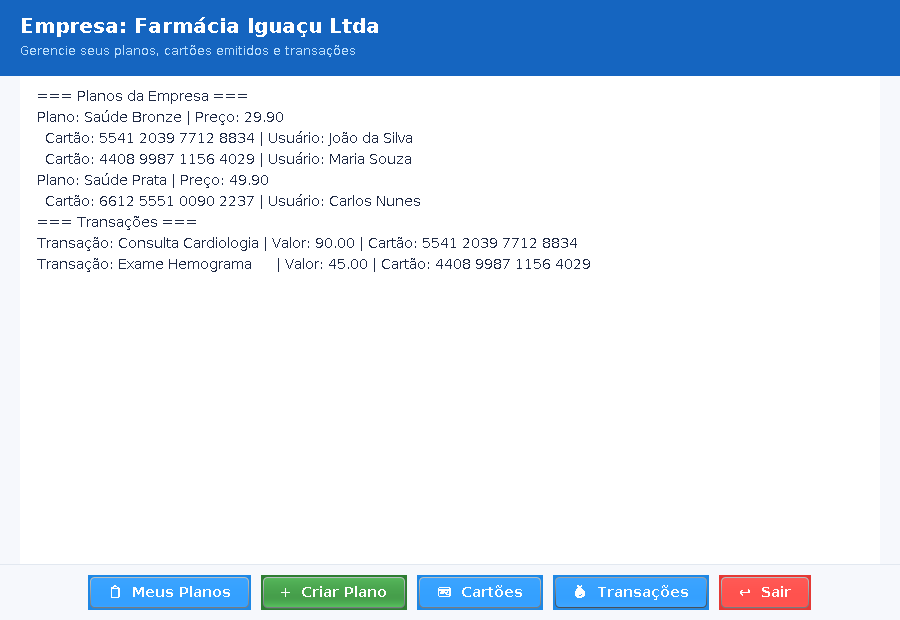 |
| **Gerenciar Usuários** | 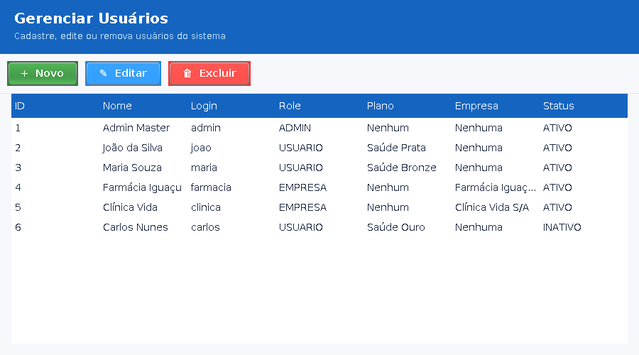 |
| **Formulário de Usuário** | 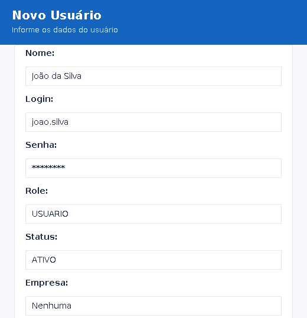 |
| **Gerenciar Empresas** | 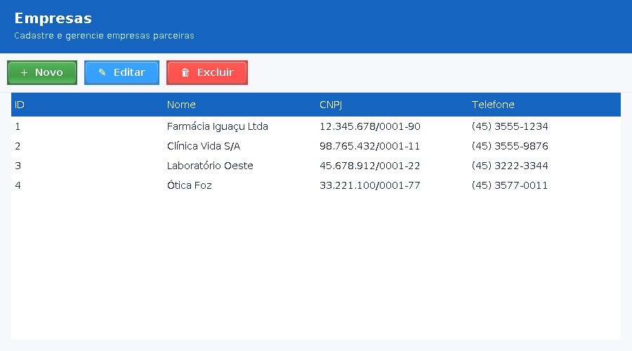 |
| **Formulário de Empresa** | 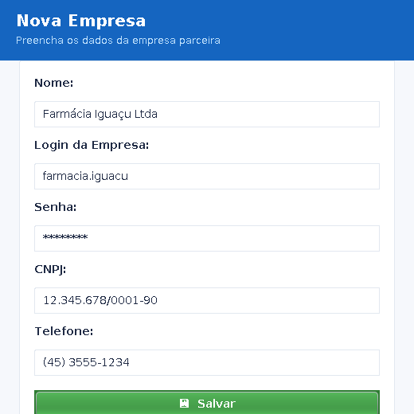 |
| **Planos disponíveis** | 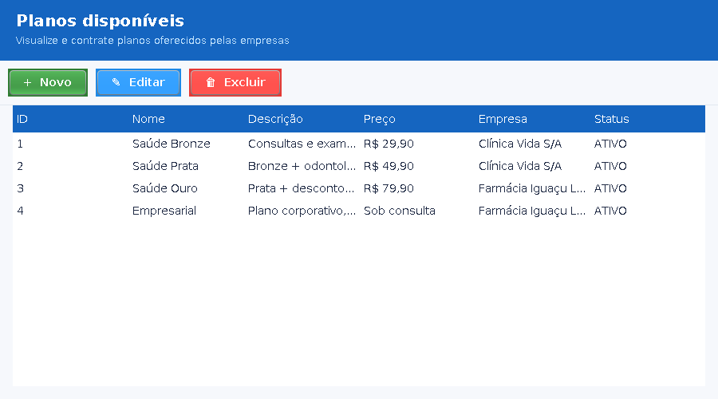 |
| **Criar/Editar Plano** | 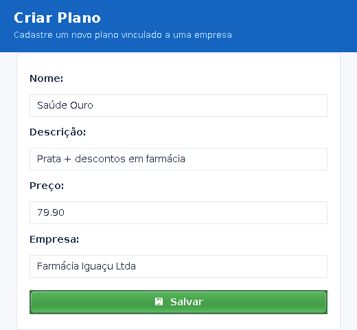 |
| **Cartões emitidos** | 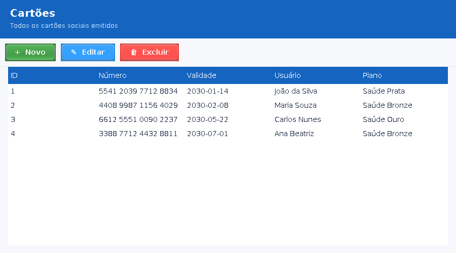 |
| **Cadastro de Cartão** | 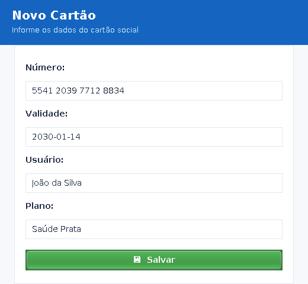 |
| **Benefícios** | 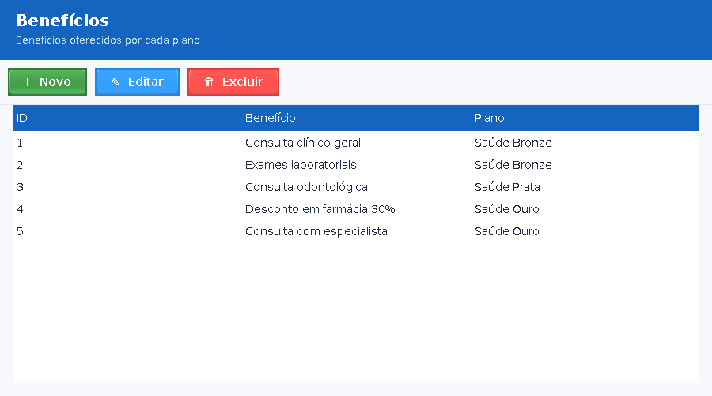 |
| **Cadastro de Benefício** | 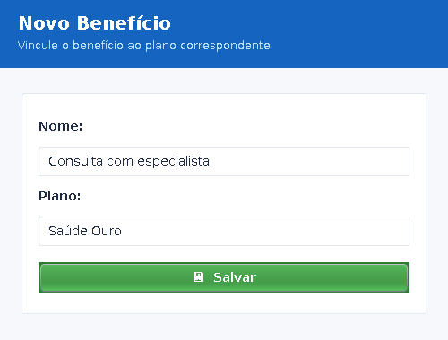 |
| **Transações** | 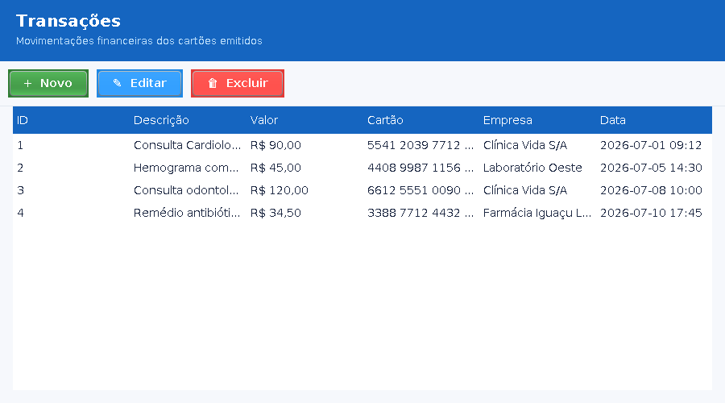 |

Os prints acima são gerados automaticamente pelo utilitário [`tools/ScreenshotPreview.java`](tools/ScreenshotPreview.java) e refletem exatamente o mesmo layout que o app entrega em runtime.

---

## 🧭 Visão Geral

O **IguaçuCard** é um sistema para gerenciar:

- 👤 **Usuários** — clientes finais que contratam planos.
- 🏢 **Empresas parceiras** — quem oferece os planos e serviços.
- 📋 **Planos** — pacotes de benefícios criados pelas empresas.
- 💳 **Cartões sociais** — emitidos automaticamente para o usuário que contrata um plano.
- 🎁 **Benefícios** — serviços/descontos vinculados a um plano.
- 💰 **Transações** — histórico de uso dos cartões.

Cada perfil de acesso enxerga apenas o que faz sentido para ele (ADMIN, EMPRESA e USUÁRIO).

---

## 🛠 Stack

| Camada | Tecnologia |
|--------|------------|
| Linguagem | **Java 18+** (compila no 17/18/21) |
| Interface | **Swing** com tema customizado (Nimbus + `UITheme`) |
| ORM | **Hibernate 6** + **Jakarta Persistence 3.1** |
| Banco | **MySQL 8** (padrão) — ou **H2** embarcado (arquivo `iguacuDB.mv.db`) |
| Build | **Maven** |
| Segurança | Hash de senha (`PasswordUtil`) e controle de sessão (`SessionContext`) |

---

## 📁 Estrutura do Projeto

```
src/main/java/org/example
├── Main.java                 # Ponto de entrada — aplica o tema e abre o LoginFrame
├── config
│   └── JPAUtil.java          # EntityManagerFactory da unidade "iguacuPU"
├── model                     # Entidades JPA
│   ├── Usuario, Empresa, Plano, Cartao, Transacao, Beneficio, Notificacao
│   └── enums/Role.java       # ADMIN / EMPRESA / USUARIO
├── dto                       # DTOs para transporte de dados
├── DAO                       # Acesso ao banco (Hibernate)
├── service                   # Regras de negócio
│   ├── AuthService           # Login + registro + hash
│   ├── UsuarioService
│   ├── EmpresaService
│   ├── PlanoService
│   ├── CartaoService         # Inclui emissão automática de cartão social
│   ├── TransacaoService
│   ├── BeneficioService
│   └── InicializadorService  # Popula dados básicos
├── controller                # Orquestração entre view e service
├── security
│   ├── PasswordUtil          # Hash/verify de senha
│   ├── RoleValidator
│   ├── SecurityGuard
│   └── Sessao                # Sessão legada (mantida)
├── session
│   └── SessionContext        # Sessão atual (usuário logado + helpers de role)
└── swing                     # Interface gráfica
    ├── ui/UITheme.java       # 🎨 Tema global (cores, fontes, botões, tabelas)
    ├── LoginFrame, RegisterDialog, MainFrame
    ├── PainelAdmin, PainelEmpresa, PainelUsuario
    ├── usuarios/   (Lista + Form)
    ├── empresas/   (Lista + Form)
    ├── planos/     (Lista + Form + AdminForm)
    ├── cartoes/    (Lista + Form)
    ├── beneficios/ (Lista + Form)
    └── transacoes/ (Lista)
```

---

## 👥 Perfis de acesso

### 👤 Usuário Comum
- Cadastro e login
- Visualiza planos disponíveis e **contrata um plano**
- Recebe automaticamente um **cartão social** ao contratar
- Consulta seus cartões e transações

### 🏢 Empresa
- Login via credenciais criadas junto com o cadastro da empresa
- Cria **planos** e associa **benefícios**
- Vê os cartões emitidos para os seus planos
- Acompanha as transações dos seus clientes

### 🛠 Administrador
- Enxerga **tudo**: usuários, empresas, planos, benefícios, cartões e transações
- CRUD completo em todas as entidades
- Pode criar planos e reatribuir empresas

---

## 🔄 Fluxo do sistema

1. Empresa é cadastrada (via admin ou via tela de registro).
2. Empresa faz login e cria seus **planos**.
3. Admin/Empresa cadastra **benefícios** vinculados aos planos.
4. Usuário se registra e faz login.
5. Usuário abre **Planos disponíveis** e clica em **Contratar plano selecionado**.
6. `CartaoService.emitirCartaoSocial()` gera um cartão SOCIAL de 16 dígitos, com validade de 5 anos, vinculado ao usuário e ao plano.
7. Transações são registradas nos cartões e ficam visíveis para todos os perfis (com filtro por escopo).

---

## ⚙ Como Rodar

### Pré-requisitos
- **Java 17+** (JDK 18 recomendado, conforme `pom.xml`)
- **Maven 3.8+**
- **MySQL 8** rodando localmente *(ou trocar para H2, veja abaixo)*

### 1. Clonar

```bash
git clone https://github.com/devheron/iguacuCardBackendSwing.git
cd iguacuCardBackendSwing
```

### 2. Ajustar o banco

Edite `src/main/resources/META-INF/persistence.xml` com as suas credenciais:

```xml
<property name="jakarta.persistence.jdbc.url"
          value="jdbc:mysql://localhost:3306/iguacucard?createDatabaseIfNotExist=true"/>
<property name="jakarta.persistence.jdbc.user"     value="root"/>
<property name="jakarta.persistence.jdbc.password" value="SUA_SENHA"/>
```

O `hibernate.hbm2ddl.auto=update` cria/atualiza o schema automaticamente na primeira execução.

> **Alternativa H2 (embarcado):** troque `jdbc.driver` para `org.h2.Driver` e `jdbc.url` para `jdbc:h2:./iguacuDB;AUTO_SERVER=TRUE`. O arquivo `iguacuDB.mv.db` já vem versionado como amostra.

### 3. Rodar

```bash
mvn compile
mvn exec:java "-Dexec.mainClass=org.example.Main"
```

Isso abre a tela de login já com o tema aplicado.

### 4. Gerar prints (opcional)

Um utilitário renderiza todas as telas para PNG (usado nos prints deste README):

```bash
# Instalar Xvfb se não tiver
sudo apt-get install -y xvfb

# Compilar e rodar o preview
mvn -q compile
CP="target/classes:$(mvn -q dependency:build-classpath -Dmdep.outputFile=/dev/stdout)"
javac -d target/classes -cp "$CP" tools/ScreenshotPreview.java
xvfb-run -a --server-args="-screen 0 1400x1200x24" \
    java -cp "$CP" ScreenshotPreview
# → docs/screenshots/*.png
```

---

## 🎨 Tema visual (`swing/ui/UITheme`)

Toda a identidade visual está centralizada em `org.example.swing.ui.UITheme`. Ele:

- Instala o **Nimbus Look & Feel** e sobrescreve as cores primárias.
- Define uma **paleta** (`PRIMARY`, `PRIMARY_DARK`, `ACCENT`, `DANGER`, `SUCCESS`, `BG`, `CARD_BG`…).
- Padroniza **fontes** (`FONT_BASE`, `FONT_TITLE`, `FONT_H2`, `FONT_BOLD`).
- Fornece **fábricas** para componentes coerentes:
  - `primaryButton`, `secondaryButton`, `successButton`, `dangerButton`
  - `styleTextField`, `styleComboBox`, `styleTable`
  - `headerBar(title, subtitle)`, `toolbar()`, `footerBar()`, `card(layout)`
- Aplicado uma vez em `Main.java` via `UITheme.install()`.

Para trocar a cor primária inteira do app, basta editar as constantes de `UITheme`.

---

## 🔐 Segurança

- Senhas são armazenadas com hash (`PasswordUtil.hash` / `matches`).
- `SessionContext` mantém o usuário logado e expõe `isAdmin()`, `isEmpresa()`, `isUsuario()`.
- `RoleValidator` e `SecurityGuard` centralizam validações de permissão.
- Botões **Sair** dos painéis chamam `SessionContext.logout()` antes de reabrir o login.

---

## 🔌 Frontend

Este backend expõe a experiência real do produto. A **landing page** institucional
que apresenta o serviço aos clientes finais fica em:

👉 https://github.com/devheron/iguacuCardPage

---

## 🚧 Roadmap

- REST API (Spring Boot) para expor o backend a outras interfaces
- Dashboards com relatórios gráficos
- Notificações em tempo real
- Integração com gateway de pagamento
- Migração parcial para JavaFX / Web

---

## 👥 Autores

- **Heron Felipe** ([@devheron](https://github.com/devheron))
- **Nicolas Gabriel**
- *Projeto finalizado no final de 2025.*

---

## 📄 Licença

Uso educacional/portfólio — livre para estudo e adaptação.
